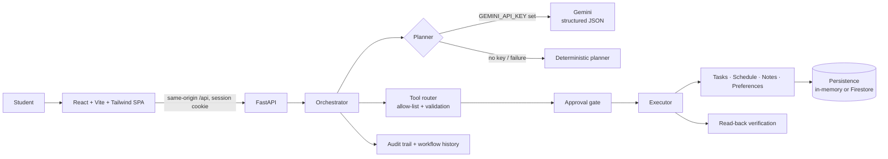

<div align="center">

# 🎓 CampusPilot AI

### The study planner that asks before it acts — and proves what it did.

[](https://github.com/kirancodes-dev/promptwars-campus-agent/actions/workflows/ci.yml)

**[▶ Open the live app](https://campuspilot-ai-165103643932.asia-south1.run.app)** · [3-minute demo](docs/demo-script.md) · [Architecture](docs/architecture.md) · [Security review](docs/security.md) · [Test evidence](docs/testing.md)

*Built for PromptWars × Error Zero 2026 — vertical: **AI Personal Assistant & Autonomous Agents***

</div>

---

You type one sentence:

> *"I have a DBMS exam on Friday and a DAA exam on Monday. I need 4 hours of DBMS and 3 hours of DAA."*

CampusPilot reads your schedule, works out the days you have before each exam, and spreads study sessions across them, earliest exam first. It avoids your existing commitments and follows your saved preferences. Then it **stops and shows you exactly what it wants to change**. Nothing is saved until you tap **Approve**. After you approve, it saves each item, **reads it back from the database to prove it was saved correctly**, and records every step in an activity log you can open.

Most AI assistants either only talk, or act without asking. CampusPilot does the planning work *and* keeps you in control.

> **Live now:** Google Cloud Run + Firestore (asia-south1). Revision **`campuspilot-ai-00005-c5s`**, deployed from commit `e407c52`. The public app was smoke-tested end to end on 2026-10-09 ([results](#-verified-live)).
>
> **Gemini is disabled in production.** The app's built-in planner provides every feature on the live site; it needs no AI key.
>
> This is a competition prototype with anonymous browser sessions, not a production multi-user service. See [Known limitations](#known-limitations).

## ✨ At a glance

| | |
|---|---|
| 🧠 **Understands real goals** | Any subject and duration, dates ("tomorrow", "on Friday", "in 3 days", "15 Oct"), exam deadlines, priorities and meeting times. It shows **what it understood and where each fact came from**: *you said*, *saved preference*, *default* or *inferred*. |
| ❓ **Asks instead of guessing** | If a date is vague ("next week"), an exam has no study time, or the time doesn't fit, it asks one focused question and quotes the real free time. |
| 🔒 **Nothing changes without your yes** | Every data-changing step is held on the **server** for approval. An approval is tied to your session and a SHA-256 hash of the exact changes. It works only once and expires after 15 minutes. |
| ✅ **Proves what it did** | It reports "saved" only after reading each item back from storage and confirming it matches what you approved. |
| 🛡️ **Treats AI output as untrusted** | Plans can only use 17 allow-listed tools, and every parameter is validated. There is no `eval` or `exec`. The model can never approve its own changes. |
| 📴 **Works without AI** | A deterministic planner covers every feature, and the app always shows which planner is running. |
| 📱 **Designed for phones first** | Bottom navigation, a sticky approval bar and 44 px touch targets. No horizontal scrolling at any width from 320 px up. |

---

## Chosen Challenge Vertical

**AI Personal Assistant & Autonomous Agents**

CampusPilot AI is an academic and productivity assistant for students. It addresses the vertical as follows (each point is implemented in this repository):

- **Understands goals.** A student writes a goal in plain English ("2 hours of DBMS, 1 hour of DAA, meeting at 4 PM", "DBMS exam on Friday and DAA exam on Monday, 4 hours and 3 hours"). The planner extracts:
  - subjects and durations;
  - dates (today, tomorrow, weekdays, "in 3 days", "15 Oct");
  - exam deadlines and priorities;
  - meeting times and explicitly requested times.

  It shows **what it understood and where each fact came from** (you said / saved preference / default / inferred) and states its assumptions. When something essential is missing or vague ("next week", an exam with no study time), it asks one focused question instead of guessing.
- **Breaks goals into dependent steps.** Each goal becomes a structured workflow of ordered steps with explicit dependencies. Before anything runs, the workflow is checked for missing, self-referencing and circular dependencies.
- **Uses tools.** Steps call 17 allow-listed tools for tasks, the schedule (including conflict checks and free-slot search), notes and study preferences.
- **Keeps a human in control.** Every step that would change data waits for the student's explicit approval; read-only steps run on their own.
- **Verifies results.** After approval, each change is saved once and then read back from storage to confirm it matches what was approved.
- **Is transparent.** Every workflow, approval, tool result and verification is recorded in an activity history and audit log that the student can open in the app.
- **Can use Gemini, but doesn't depend on it.** When `GEMINI_API_KEY` is set, Gemini (default `gemini-3.8-flash`) produces the plan as structured JSON. Without a key, or if Gemini fails, the deterministic planner takes over and the app says so. The Gemini path is covered by mocked tests. It is **disabled in production**; in a non-public test revision it did not reliably propose study sessions, so it was not released (see [Gemini](#gemini-optional)).

## The problem

Students juggle classes, meetings and revision across tools that don't talk to each other. Chatbots can suggest a timetable, but they either can't act on your data or they act without asking. Students need an assistant that does the tedious planning *and* keeps them in control.

**Target users:** college students who plan study sessions, deadlines and revision around existing commitments, mostly on their phones.

## How the solution works

Try the flagship goal (it's one tap on the home screen of the [live app](https://campuspilot-ai-165103643932.asia-south1.run.app)):

> "Organize my preparation for tomorrow. I need 2 hours of DBMS, 1 hour of DAA, and I have a project meeting at 4 PM."

CampusPilot will:

1. **Understand** the subjects and durations you asked for. Any subject works; there is no fixed list.
2. **Read** your existing schedule and check the meeting slot for conflicts.
3. **Find** free slots inside your preferred study window, using your break length and subject timing preferences (for example, "DBMS in the evening").
4. **Explain** an 8-step plan: which steps only read data, which would change it, and why.
5. **Ask** you to approve the three proposed changes (two study blocks, one task). Nothing is saved yet.
6. **Save and verify:** after you approve, it saves each item, reads it back, and reports exactly what was saved.
7. **Record** every step in an activity timeline and audit log.

**Exam mode.** If the goal includes exam dates, CampusPilot plans across several days. Each subject's study time is split into sessions of your preferred length and spread over the days before that subject's exam, earliest exam first. Sessions stay inside your study window and study days, and never fall on the exam day. If the time doesn't fit, it tells you how much free time you actually have instead of overbooking you.

**It also understands:**
- "Remember that I prefer studying DBMS in the evening, then plan …" (saves the preference and plans with it under one approval)
- "Review my schedule, identify free time, plan my DBMS revision"
- "Show my schedule"
- "Create a task to …"
- "Find my DBMS notes"
- "Reset my preferences"

## Approach and logic

CampusPilot separates *deciding* from *doing*. A planner (the built-in rule-based planner, or Gemini when configured) only proposes a plan. A server-side orchestrator then enforces the rules in code:

1. **Validate** the plan's dependencies.
2. **Run** the read-only steps.
3. **Hold** every data-changing step for approval.
4. **Execute** approved steps once, in dependency order.
5. **Verify** each result by reading it back.
6. **Log** every event.

Planner output is treated as untrusted input, so these rules hold whichever planner produced the plan.

What makes this approach different:

- **Approval is a security boundary, not just a button.** Every data-changing tool is held for approval on the server, whatever the planner or AI model says. A client cannot approve by sending `approved: true`. A replayed approval is rejected (409), as is one from another session (404) or one whose changes were altered after review (400). All three were checked against the live service.
- **Verified results.** The app reports success only after the saved data is read back and matches what you approved.
- **Honest fallbacks.** The app is fully usable without an API key. If Gemini is configured but fails or returns an unusable plan, the built-in planner takes over and the UI says so. The app also shows whether storage is durable (Firestore) or temporary.
- **No arbitrary code.** Plans can use only an allow-listed set of 17 tools, and every tool name and parameter is validated. There is no `eval` or `exec`.
- **Reliable execution.** Read steps get one retry; write steps are never retried automatically, and a step that already completed is not re-run when a workflow resumes. Each tool call has a timeout.
- **Efficient storage access.** History and audit reads are bounded Firestore queries, schedule reads use a date-range query, and audit events are written in one batch. In tests with a fake Firestore client, round trips fell from 15 to 7 per plan and from 25 to 11 per approval.

## Architecture



In production, Gemini is disabled, so every plan comes from the deterministic planner. Details: [docs/architecture.md](docs/architecture.md).

## Google Cloud services

| Service | How it's used | Status |
|---|---|---|
| **Cloud Run** (gen2) | Hosts the single container (FastAPI serving the React build), scales to zero, max 1 instance | **Live**, revision `campuspilot-ai-00005-c5s` |
| **Cloud Firestore** | Durable per-session storage for tasks, schedule, notes, preferences, workflow history and audit logs | **Live**, verified by read-back |
| **Secret Manager** | Holds the session-signing secret | **Live** |
| **Cloud Build + Artifact Registry** | Builds and stores the container image | Used for the live deployment |
| **Gemini API** (`google-genai`) | Optional planner with strict JSON validation | Integrated and tested with mocks; **disabled in production** |

## Technology

| Layer | Technology |
|---|---|
| Frontend | React 19, Vite 8, Tailwind CSS 4, lucide-react; Vitest + Testing Library |
| Backend | Python 3.12, FastAPI, Pydantic 2, uvicorn |
| AI (optional) | Google Gemini (default `gemini-3.8-flash`, configurable) via `google-genai`, structured JSON output |
| Storage (optional) | Google Cloud Firestore (`FIRESTORE_ENABLED=true`); in-memory by default |
| Hosting | Docker image built with Cloud Build → Google Cloud Run (asia-south1, gen2, scale to zero); session secret in Secret Manager |
| CI | GitHub Actions: backend tests, branch coverage and pyflakes; frontend lint, tests, coverage and build (no credentials, no deploy) |

## ✅ Verified live

The public app at revision `campuspilot-ai-00005-c5s` was smoke-tested on 2026-10-09 with an automated headless-Chrome journey and scripted API requests. These checks passed:

| Area | Checked on the live service |
|---|---|
| First visit | A session cookie is issued when the page loads, and parallel first requests share one session (no duplicate sessions) |
| Full journey | Plan → approve → saved and verified → history → preferences → reject → clarification, at widths from 320 to 1440 px, with 0 browser console errors |
| New planning features | A multi-exam plan and the "What I understood" panel |
| Persistence | Approving the flagship plan saved exactly 2 schedule events and 1 task in Firestore; all 3 were read back and verified |
| Approval security | Replay → 409; another session's approval → 404; altered changes → 400 with nothing saved; a client-sent `approved: true` does not bypass approval |
| Rate limiting | 60 state-changing requests accepted, the next one rejected with 429 |
| Transparency | Workflow history and audit log returned for the session |
| Honest status | Status endpoint reports the deterministic planner, AI unavailable, and durable Firestore storage |
| Hardening | API docs are disabled (`/openapi.json` → 404); no 5xx responses or error logs on this revision during the test |

These checks show that the deployed safeguards work as designed. They are not a full security audit, and they do not mean the app is free of vulnerabilities. See [Security limitations](#security-limitations).

## 🧪 Tests and quality

| Check | Result |
|---|---|
| Backend tests | **325 passing** (1 optional live-Gemini test skipped). Includes 21 realistic planning scenarios, 36 security tests, and 15 Gemini tests that use a mocked SDK. |
| Backend coverage (line + branch) | **87%** |
| Frontend tests | **31 passing**; ESLint clean; production build succeeds |
| Frontend coverage | 87.8% lines, 72.9% branches |
| Accessibility (axe-core 4.10.3, run locally) | **0 violations** across 9 UI states at 390 px and 1440 px |
| Keyboard-only journey (local) | **30/30** checks |
| CI | GitHub Actions runs on every push; it passed on the deployed commit `e407c52` and on the latest commit |

```bash
cd backend && ./.venv/bin/python -m unittest discover -s . -p "test_*.py"   # 325 tests (1 optional live test skipped)
pip install -r requirements-dev.txt && python -m coverage run --branch -m unittest discover -s . -p "test_*.py" && python -m coverage report
cd frontend && npm test && npm run lint && npm run build                   # 31 tests
npm run test:coverage
```

Full results, including planner scenarios, browser, keyboard and accessibility checks: [docs/testing.md](docs/testing.md). CI workflow: [.github/workflows/ci.yml](.github/workflows/ci.yml).

## Project structure

```
backend/
  main.py                 FastAPI app, session/security middleware, SPA serving
  api/agent.py            REST API (plan, run, approve, reject, workflows, audit, memory)
  agent/                  planner entry point, router (allow-list), executor, orchestrator, workflow validation + verification
  agent/planning/         intent, fact extraction, scheduling, study planner, simple builders, Gemini output validation
  services/               approvals, identity, persistence (memory/Firestore), memory, audit, gemini
  models/                 Pydantic models (agent, workflow, memory, audit)
  tools/                  tasks, schedule (conflicts, free slots), notes, memory tools
  **/test_*.py            unittest suites (325 tests)
frontend/
  src/App.jsx             app shell, plan/approve flow
  src/components/         UI components
  src/lib/                pure helpers (formatting, preferences, examples)
  src/test/               Vitest suites
deployment/cloud-run.md   step-by-step Cloud Run guide
docs/                     architecture, security, testing, deployment, demo script, submission draft
scripts/                  headless-Chrome smoke journey, axe accessibility audit, keyboard-only journey
.github/workflows/ci.yml  continuous integration
firestore.rules           deny-all rules for direct client access (the server uses IAM)
Dockerfile, .dockerignore
```

## Assumptions

- **Time zone.** Dates and times use the server's local time zone: "today", "tomorrow" and the default 09:00–21:00 study window follow the server clock. Times are stored without a time zone. The live service runs in India time (`TZ=Asia/Kolkata`); Cloud Run containers use UTC unless `TZ` is set.
- **No calendar sync.** CampusPilot manages its own tasks, schedule and notes. It does not read from or write to Google Calendar or any other external app.
- **Storage.** Without Firestore (`FIRESTORE_ENABLED=true`), data is kept in server memory and lost on restart. The live service uses Firestore. If Firestore is requested but fails to start, the app keeps running in memory and reports that storage is not durable.
- **Single instance.** Pending approvals and rate limits are held in process memory, so the service must run as one instance (`--max-instances=1` on Cloud Run).
- **Anonymous sessions.** Each browser gets a private anonymous session (signed cookie). These are not user accounts: data does not follow the student to another device, and clearing cookies starts a new, empty session.
- **English goals.** The built-in planner recognises English phrasing. Other languages might work with Gemini configured, but this has not been tested.
- **Approval.** Every change the assistant proposes (schedule, tasks, notes, preferences) requires explicit approval before it runs. Changes made directly in the Preferences form are applied when the student taps Save, and resetting preferences requires a separate confirmation.

## Setup and execution

Prerequisites: Python 3.12, Node.js 20.19+ (or 22.12+), npm. No API key or cloud account is needed to run locally.

```bash
# Backend
cd backend
python3.12 -m venv .venv
./.venv/bin/pip install -r requirements.txt
cp .env.example .env            # optional; defaults work without it
./.venv/bin/uvicorn main:app --reload --port 8000

# Frontend (second terminal)
cd frontend
npm ci
npm run dev                     # http://localhost:5173 — /api is proxied to :8000
```

Or serve the production build from FastAPI on one port:

```bash
cd frontend && npm run build
cd ../backend && ./.venv/bin/uvicorn main:app --port 8000   # open http://localhost:8000
```

### Configuration

All settings are environment variables; see [backend/.env.example](backend/.env.example). None are required.

| Variable | Default | Purpose |
|---|---|---|
| `GEMINI_API_KEY` | empty | Enables Gemini planning. Empty → built-in planner. Not set in production. |
| `GEMINI_MODEL` | `gemini-3.8-flash` | Model name. `gemini-2.5-flash` is no longer available to new API users. |
| `FIRESTORE_ENABLED` / `FIRESTORE_PROJECT_ID` | `false` / empty | Durable storage in Firestore. |
| `IDENTITY_MODE` | `session` | `session` = private anonymous session per browser; `demo` = shared user (local only). |
| `SESSION_SECRET` | random per process | Signs session cookies. Set in production via Secret Manager. |
| `APP_ENV` | `development` | `production` disables API docs, sets `Secure` cookies, drops dev CORS. |
| `RATE_LIMIT_PER_MINUTE` | `60` | Per-session limit on state-changing API calls (0 disables). |
| `RATE_LIMIT_PER_IP_PER_MINUTE` | `600` | Per-IP limit on all API calls; stops clients bypassing the session limit by dropping cookies. Generous because a campus network shares one IP. |
| `TOOL_TIMEOUT_SECONDS` | `15` | Per-tool-call timeout; timed-out writes are reported, never retried. |
| `APPROVAL_TTL_SECONDS` | `900` | Approval expiry. |

The frontend has no secrets. `VITE_*` variables are public; leave `VITE_API_BASE_URL` unset to use same-origin requests.

### Gemini (optional)

**Production status: disabled.** The live service has no `GEMINI_API_KEY`, so it uses the built-in planner, and its status panel says so. Every feature described above works without Gemini.

To try Gemini locally:

1. Create a key in Google AI Studio.
2. Put it in `backend/.env` as `GEMINI_API_KEY=...` (this file is git-ignored). Never put the key in frontend code or in chat.
3. Optionally set `GEMINI_MODEL` (default `gemini-3.8-flash`).
4. Restart the backend. The header status panel shows "Planner: Gemini AI".

A real request also needs available credits or free-tier quota on the key's Google AI Studio project. Otherwise Google returns 402 and the app falls back to the built-in planner.

Gemini output is treated as untrusted:
- The response must match a strict schema: allowed fields, types and bounded sizes.
- Tool names and parameters go through the same router validation and approval policy as the built-in planner.
- Approval flags sent by the model are discarded.

Timeouts, quota or authentication errors, and unusable output all fall back to the built-in planner. The plan is then labelled "Built-in planner (AI fallback)" with the reason.

**Gemini is not released to production.** Real Gemini calls succeeded on a non-public test revision, but for study-planning goals Gemini often proposed no study sessions, so the public app stays on the built-in planner. The code now falls back to the built-in planner when Gemini proposes no changes for a study goal. The integration is covered by mocked tests. An optional live test runs only when `CAMPUSPILOT_LIVE_GEMINI_TEST=1` is set and your own key is configured.

### Firestore (optional)

Set `FIRESTORE_ENABLED=true` and `FIRESTORE_PROJECT_ID`, with Application Default Credentials available: `gcloud auth application-default login` locally, or the service account on Cloud Run. If Firestore fails to initialise, the app keeps running in memory and reports `memory_fallback`, so nobody believes data is durable.

Firestore is verified live on the deployed service. History and audit reads are bounded queries (newest first, limited), and schedule reads use a date-range query.

## Docker and Cloud Run

```bash
docker build -t campuspilot-ai:local .
docker run --rm -p 8080:8080 campuspilot-ai:local
curl http://localhost:8080/health
```

`docker run` has not been tested locally because Docker was unavailable. The same Dockerfile is built with Cloud Build for the live deployment. Deployment steps: [deployment/cloud-run.md](deployment/cloud-run.md). Readiness and rollback: [docs/deployment.md](docs/deployment.md).

## Demo

A 3-minute script that works with no API key: [docs/demo-script.md](docs/demo-script.md).

## Security limitations

- **No account login.** Each browser gets a private anonymous session (signed HttpOnly cookie). This keeps visitors' data separate, but data cannot follow you to another device, and clearing cookies starts over. A real login (for example, Firebase Authentication) is needed before a public multi-user launch.
- **Single instance.** Pending approvals and rate limits are held in process memory, so the service runs as one Cloud Run instance (`--max-instances=1`) until they move to shared storage.
- **Rate limits are approximate.** They are counted per process, per IP and per session. A determined attacker with many IP addresses can still create many anonymous sessions.
- **Default storage is temporary.** In-memory data is lost on restart, and the UI says so. The live service uses Firestore.

The checks above were run and passed; they are not a guarantee that the app is secure. Full review: [docs/security.md](docs/security.md).

## Known limitations

- **Anonymous browser sessions only.** There are no user accounts.
- **Single Cloud Run instance** (`--max-instances=1`).
- **India server time zone** (`TZ=Asia/Kolkata`). Times follow the server's time zone; there are no per-user time zones yet.
- **No calendar sync.** CampusPilot works only with its own tasks, schedule and notes, with no Google Calendar or other external app integration.
- **Gemini is disabled in production**, and a live Gemini call has not been verified.
- **Not tested on real phones or with screen readers.** Mobile layout was checked in browser emulation; accessibility was checked with automated rules and keyboard-only testing.
- **Common phrasing only.** The built-in planner understands common phrasings ("2 hours of DBMS", "DAA for 90 minutes", "meeting at 4 PM", "exam on Friday", "15 Oct"); unusual phrasing may need rewording.
- **Meetings are assumed to last 1 hour** and are placed on the planning day unless the goal gives their date. The plan states this assumption.
- **At most 12 study sessions** are scheduled per plan.
- **`docker run` not tested locally** (the image builds on Cloud Build).

## What's next

These items are **not implemented** yet:
- Real sign-in with Firebase Authentication.
- A shared approval and rate-limit store so the service can run on more than one instance.
- Per-user time zones.
- Optional Google Calendar sync.
- A verified live Gemini planner.
- Testing with VoiceOver, TalkBack and real phones.

## License

No license file has been added. All rights reserved by the author until a license is chosen.
