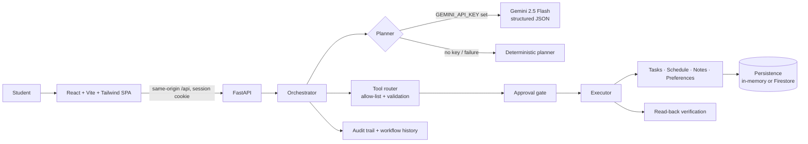

# CampusPilot AI

**Tell CampusPilot what you need to study; it reads your schedule, plans conflict-free sessions, and changes nothing until you approve.**

CampusPilot AI is an autonomous planning assistant for students, built for PromptWars × Error Zero 2026. It turns a plain-language goal into a step-by-step workflow, runs the safe read-only steps itself, asks for approval before any change to your data, then saves and verifies each change by reading it back.

> Status: competition prototype. Not production-ready for a public multi-user service (no account login yet; see [Security limitations](#security-limitations)). Not deployed.

---

## Chosen Challenge Vertical

**AI Personal Assistant & Autonomous Agents**

CampusPilot AI is an academic and productivity assistant for students. It addresses the vertical as follows (each point is implemented in this repository):

- **Understands goals.** A student writes a goal in plain English ("2 hours of DBMS, 1 hour of DAA, meeting at 4 PM"). The planner detects the intent and extracts subjects, durations, meeting times and explicitly requested times.
- **Breaks goals into dependent steps.** Each goal becomes a structured workflow: ordered steps with explicit dependencies, validated for missing, self-referencing or circular dependencies before anything runs.
- **Uses tools.** Steps call 17 allow-listed tools for tasks, schedule (including conflict checks and free-slot search), notes and study preferences.
- **Keeps a human in control.** Every step that would change data waits for the student's explicit approval; read-only steps run on their own.
- **Verifies results.** After approval, each change is saved once and then read back from storage to confirm it matches what was approved.
- **Is transparent.** Every workflow, approval, tool outcome and verification is recorded in an activity history and audit log visible in the app.
- **Uses Gemini when configured.** With `GEMINI_API_KEY` set, Gemini 2.5 Flash produces the plan as structured JSON; without a key, or if Gemini fails, a deterministic planner takes over and the app says so. (The Gemini path is tested with mocks; it has not been run against the live API in this repository.)

## The problem

Students juggle classes, meetings and revision across tools that don't talk to each other. Generic chatbots can suggest a timetable, but they either can't act on your data or they act without asking. Students need an assistant that does the tedious planning *and* keeps them in control.

**Target users:** college students planning study sessions, deadlines and revision around existing commitments.

## How the solution works

Try the flagship goal:

> "Organize my preparation for tomorrow. I need 2 hours of DBMS, 1 hour of DAA, and I have a project meeting at 4 PM."

CampusPilot will:

1. Parse the subjects and durations you actually asked for (any subject, not a fixed list).
2. Read your existing schedule and check the meeting slot for conflicts.
3. Pick free slots inside your preferred study window, applying your break length and per-subject timing preferences (e.g. "DBMS in the evening").
4. Show an 8-step plan: which steps read data, which would change it, and why.
5. Ask you to approve the three proposed changes (two study blocks, one task). Nothing is saved yet.
6. On approval, save each item, read it back to verify it, and report exactly what was saved.
7. Record every step in an activity timeline and audit log.

Other things it understands: "Remember that I prefer studying DBMS in the evening, then plan …" (saves the preference and plans with it under one approval), "Review my schedule, identify free time, plan my DBMS revision", "Show my schedule", "Create a task to …", "Find my DBMS notes", "Reset my preferences".

## Approach and logic

CampusPilot separates *deciding* from *doing*. A planner (Gemini or the built-in rule-based planner) only proposes a plan. A server-side orchestrator then enforces the rules in code: validate the plan's dependencies, run read-only steps, hold every data-changing step for approval, execute approved steps once in dependency order, verify each result by reading it back, and log every event. Model output is treated as untrusted input, so the safety rules hold whichever planner produced the plan.

What makes this approach different:

- **Human approval as a security boundary, not a UI nicety.** Every data-changing tool is approval-gated on the server, whatever the planner or the AI model says. Approvals are bound to your session, the workflow and a SHA-256 hash of the exact reviewed actions; they're single-use and expire after 15 minutes. A client cannot approve by setting a flag.
- **Verified results.** Success is reported only after the saved state is read back and matches what you approved.
- **Honest fallbacks.** Works fully without an API key using a deterministic planner. If Gemini is configured but fails or returns an unusable plan, the built-in planner takes over and the UI says so. Storage durability is shown honestly ("temporary demo storage" vs Firestore).
- **No arbitrary code.** The model can only choose from an allow-listed set of 17 tools; every name and parameter is validated. No `eval`/`exec`.
- **Mobile-first.** Designed for a phone first: bottom navigation, sticky approval bar, 44 px touch targets, no horizontal scrolling from 320 px up.

## Architecture



Details: [docs/architecture.md](docs/architecture.md).

## Technology

| Layer | Technology |
|---|---|
| Frontend | React 19, Vite 8, Tailwind CSS 4, lucide-react; Vitest + Testing Library |
| Backend | Python 3.12, FastAPI, Pydantic 2, uvicorn |
| AI (optional) | Google Gemini (`gemini-2.5-flash`) via `google-genai`, structured JSON output |
| Storage (optional) | Google Cloud Firestore (`FIRESTORE_ENABLED=true`); in-memory by default |
| Hosting (prepared, not deployed) | Docker → Google Cloud Run, secrets in Secret Manager |

## Project structure

```
backend/
  main.py                 FastAPI app, session/security middleware, SPA serving
  api/agent.py            REST API (plan, run, approve, reject, workflows, audit, memory)
  agent/                  planner, router (allow-list), executor, orchestrator, workflow validation
  services/               approvals, identity, persistence (memory/Firestore), memory, audit, gemini
  models/                 Pydantic models (agent, workflow, memory, audit)
  tools/                  tasks, schedule (conflicts, free slots), notes, memory tools
  **/test_*.py            unittest suites (256 tests)
frontend/
  src/App.jsx             app shell, plan/approve flow
  src/components/         UI components
  src/lib/                pure helpers (formatting, preferences, examples)
  src/test/               Vitest suites
deployment/cloud-run.md   step-by-step Cloud Run guide
docs/                     architecture, security, testing, deployment, demo script, submission draft
Dockerfile, .dockerignore
```

## Assumptions

- **Time zone.** Dates and times are interpreted in the server's local time zone ("today", "tomorrow" and the default 09:00–21:00 study window use the server clock). Times are stored without a time zone. Cloud Run containers run in UTC unless the `TZ` environment variable is set; the deployment guide sets `TZ=Asia/Kolkata`.
- **No calendar sync.** CampusPilot manages its own tasks, schedule and notes. It does not read from or write to Google Calendar or any other external app.
- **Storage.** Data is kept in server memory and lost on restart unless Firestore is enabled (`FIRESTORE_ENABLED=true`). If Firestore is requested but fails to start, the app keeps running in memory and reports that storage is not durable.
- **Single instance.** Pending approvals and rate limits are held in process memory, so the service must run as one instance (`--max-instances=1` on Cloud Run).
- **Anonymous sessions.** Each browser gets a private anonymous session (signed cookie). These are not user accounts: data does not follow the student to another device, and clearing cookies starts a new empty session.
- **English goals.** The built-in planner recognises English phrasing. Other languages may only work when Gemini is configured, and that has not been tested.
- **Approval.** Every change the assistant proposes (schedule, tasks, notes, preferences) requires explicit approval before it runs. Edits a student makes directly in the Preferences form are applied when they press Save, and resetting preferences requires a separate confirmation.

## Setup and execution

Prerequisites: Python 3.12, Node.js 20.19+ (or 22.12+), npm.

```bash
# Backend
cd backend
python3.12 -m venv .venv
./.venv/bin/pip install -r requirements.txt
cp .env.example .env            # optional; defaults work without it
./.venv/bin/uvicorn main:app --reload --port 8000

# Frontend (second terminal)
cd frontend
npm ci
npm run dev                     # http://localhost:5173 — /api is proxied to :8000
```

Or serve the production build from FastAPI on one port:

```bash
cd frontend && npm run build
cd ../backend && ./.venv/bin/uvicorn main:app --port 8000   # open http://localhost:8000
```

### Configuration

All settings are environment variables; see [backend/.env.example](backend/.env.example). None are required.

| Variable | Default | Purpose |
|---|---|---|
| `GEMINI_API_KEY` | empty | Enables Gemini planning. Empty → built-in planner. |
| `GEMINI_MODEL` | `gemini-2.5-flash` | Model name. |
| `FIRESTORE_ENABLED` / `FIRESTORE_PROJECT_ID` | `false` / empty | Durable storage in Firestore. |
| `IDENTITY_MODE` | `session` | `session` = private anonymous session per browser; `demo` = shared user (local only). |
| `SESSION_SECRET` | random per process | Signs session cookies. Set in production via Secret Manager. |
| `APP_ENV` | `development` | `production` disables API docs, sets `Secure` cookies, drops dev CORS. |
| `RATE_LIMIT_PER_MINUTE` | `60` | Per-session limit on state-changing API calls (0 disables). |
| `APPROVAL_TTL_SECONDS` | `900` | Approval expiry. |

The frontend has no secrets. `VITE_*` variables are public; leave `VITE_API_BASE_URL` unset to use same-origin requests.

### Gemini (optional)

1. Create a key in Google AI Studio.
2. Put it in `backend/.env` as `GEMINI_API_KEY=...` (git-ignored) — never in frontend code or chat.
3. Restart the backend. The header status panel shows "Planner: Gemini AI".

Gemini output is treated as untrusted: tool names and parameters go through the same router validation and approval policy as the built-in planner, and any error falls back to the built-in planner. The live Gemini integration has **not** been exercised in this repository (no key was available); it is covered by mocked tests.

### Firestore (optional)

Set `FIRESTORE_ENABLED=true` and `FIRESTORE_PROJECT_ID`, with Application Default Credentials available (`gcloud auth application-default login` locally; the service account on Cloud Run). If Firestore fails to initialise, the app keeps running on memory and reports `memory_fallback` so nobody believes data is durable. Not verified against a live Firestore instance (mocked tests only).

## Tests

```bash
cd backend && ./.venv/bin/python -m unittest discover -s . -p "test_*.py"   # 256 tests
cd frontend && npm test && npm run lint && npm run build                   # 21 tests
```

See [docs/testing.md](docs/testing.md) for what is covered, including the headless-Chrome journey used for browser verification.

## Docker and Cloud Run

```bash
docker build -t campuspilot-ai:local .
docker run --rm -p 8080:8080 campuspilot-ai:local
curl http://localhost:8080/health
```

Docker was not available in the development environment, so the image has **not** been built or run yet. The production configuration it uses was verified by running the same app with `APP_ENV=production`. Deployment steps: [deployment/cloud-run.md](deployment/cloud-run.md). Nothing has been deployed.

## Demo

A 3-minute script that works with no API key: [docs/demo-script.md](docs/demo-script.md).

## Screenshots

No screenshots are committed yet. Capture them from the running app (see the demo script) before submission.

## Security limitations

- **No account authentication.** Each browser gets a private anonymous session (signed HttpOnly cookie). This isolates visitors from each other, but data cannot follow you to another device, and clearing cookies starts over. A real login (e.g. Firebase Authentication) is needed before a public multi-user launch.
- **Single instance.** Pending approvals and rate limits live in process memory; run one Cloud Run instance (`--max-instances=1`) until they move to shared storage.
- **Default storage is temporary.** In-memory data is lost on restart; the UI says so.

Full review: [docs/security.md](docs/security.md).

## Known limitations

- Works with CampusPilot's own tasks, schedule and notes only — no Google Calendar or other external app integration.
- Times are interpreted in the server's local time zone (no per-user time zones yet).
- The deterministic planner understands common phrasings ("2 hours of DBMS", "DAA for 90 minutes", "meeting at 4 PM"); unusual phrasing may need rewording or Gemini.

## License

No license file has been added. All rights reserved by the author until a license is chosen.
