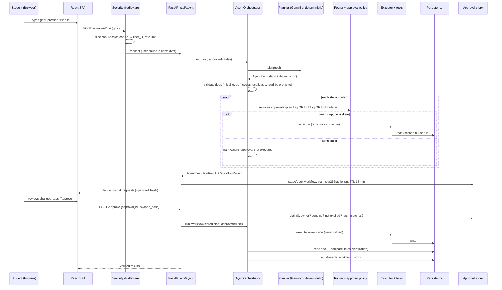

# Architecture

CampusPilot AI is one deployable unit: a FastAPI backend that also serves the built React SPA. Everything below describes code that exists in this repository.

## Request flow



## Components

| Component | File | Responsibility |
|---|---|---|
| Security middleware | `backend/main.py` | 32 KB body cap, anonymous session identity, per-session rate limit, security headers/CSP, JSON 500s |
| Identity | `backend/services/identity.py` | HMAC-signed `cp_session` cookie → `session-<id>` user; contextvar used by every tool |
| API | `backend/api/agent.py` | REST endpoints; stages approvals; never forwards a client approval flag |
| Orchestrator | `backend/agent/orchestrator.py` | Planning with fallback, approval policy, sequential dependency-gated execution, retries, timeouts, verification, audit |
| Planner entry point | `backend/agent/planner.py` | `plan_goal` (deterministic) and `plan_goal_smart` (Gemini with fallback); dispatch by intent |
| Intent | `backend/agent/planning/intent.py` | Ordered rule table: which kind of request this is |
| Fact extraction | `backend/agent/planning/extraction.py` | Subjects + durations, dates, exam deadlines, priorities, meeting, explicit times, vague dates |
| Scheduling | `backend/agent/planning/scheduling.py` | Free-slot search over a calendar of busy time; single-day and earliest-deadline-first multi-day allocation |
| Study planner | `backend/agent/planning/study.py` | Builds the read-before-write workflow, explanations, "understanding" facts with sources, assumptions, clarification questions |
| Simple builders | `backend/agent/planning/builders.py`, `preferences_text.py` | Tasks, notes, listings, preferences |
| Gemini validation | `backend/agent/planning/gemini_plan.py` | Strict schema for model output, router validation, approval policy, reason-specific errors |
| Router | `backend/agent/router.py` | Tool allow-list (17 tools), required/unknown parameter checks, value validation, `mutates` flag |
| Executor | `backend/agent/executor.py` | Maps tool names to Python functions; refuses protected tools without approval |
| Workflow validation/verification | `backend/agent/workflow.py` | Dependency graph checks; read-back verification for every write tool |
| Approval store | `backend/services/approvals.py` | User-bound, hash-bound, single-use, expiring approvals (in process memory) |
| Persistence | `backend/services/persistence.py`, `in_memory.py`, `firestore.py` | Same interface for memory and Firestore; all data keyed by user |
| Gemini | `backend/services/gemini.py` | Prompt with tool catalog and fenced untrusted goal; JSON mode; 20 s timeout |

## Workflow model

`backend/models/workflow.py`:

- `WorkflowRecord`: `workflow_id`, `goal`, `status` (`planned`, `waiting_approval`, `running`, `completed`, `partially_completed`, `failed`, `rejected`, `needs_clarification`), `created_at`, `updated_at`, `planner_mode`, `planner_note`, `approval_id`, `steps`, `summary`, `next_action`.
- `WorkflowStep`: `step_id`, `order`, `title`, `description`, `kind` (`read`/`write`/`reasoning`), `tool`, `parameters`, `depends_on`, `requires_approval`, `status` (`planned`, `waiting_approval`, `running`, `completed`, `failed`, `skipped`, `blocked`, `rejected`), `attempts`, `retry_eligible`, `result`, `error`, `verification` (`checked`, `passed`, `detail`), timestamps.

Execution rules (sequential, in plan order):

1. A step runs only when every dependency is `completed`. A failed/blocked dependency makes the step `blocked` with an explanation; independent steps still run (partial completion).
2. Approval policy: a step requires approval if the plan says so, the tool is registered as approval-required, **or the tool changes data** (`mutates=True`). Planner or model output can add approval but never remove it.
3. Read steps may run twice (one retry); write steps run at most once and are never retried automatically.
4. A write step already `completed` in this workflow is never re-executed (idempotent resume).
5. Each tool call has a timeout (`TOOL_TIMEOUT_SECONDS`, default 15 s). A timed-out write is reported as "may or may not have been saved; not retried".
6. Successful writes are verified by reading the stored entity and comparing the approved fields.

## Planning

- **Deterministic planner** (always available): intent detection → builders. The study planner extracts facts (`GoalFacts`): `(subject, minutes)` pairs ("2 hours of DBMS", "DAA for 90 minutes"), a planning date ("tomorrow", "on Friday", "in 3 days", "15 Oct"), exam deadlines per subject, priorities, an optional meeting time and explicit per-subject times ("DBMS at 6 PM").
  - **Single day** (no exam dates): non-overlapping slots inside the saved study window, higher priority first, honouring break length and subject time-of-day preferences, avoiding existing events and the meeting.
  - **Before exams** (exam dates given): each subject's time is split into sessions of the preferred length and spread over the study days before its exam (earliest deadline first, never on the exam day), at most 12 sessions per plan.
  - **Never guesses**: vague dates, exams without study time, past exam dates, conflicts with an explicitly requested time, or not enough free time produce one focused question that quotes the real numbers.
  - Every plan carries `understanding` (facts with source: you said / saved preference / default / inferred) and `assumptions`.
- **Gemini planner** (when `GEMINI_API_KEY` is set): structured JSON with a tool catalog. Output is capped (12 tool calls, string lengths), `requires_approval` and `user_id` fields from the model are discarded/rejected, writes are made to depend on preceding reads, and the plan must pass the same dependency validation. Any failure → deterministic plan with `planner_mode="deterministic_fallback"` and a user-visible note.

## Storage layout

In memory: dictionaries keyed by user ID. In Firestore:

```
users/{user_id}/tasks/{task_id}
users/{user_id}/schedule/{event_id}
users/{user_id}/notes/{note_id}
users/{user_id}/preferences/default
users/{user_id}/audit_logs/{audit_id}
users/{user_id}/workflows/{workflow_id}
```

Pending approvals and rate-limit counters are **not** persisted (process memory only).

Read/write efficiency (Firestore adapter):
- Audit log and workflow history: `order_by(...DESC).limit(n)` — reads exactly `n` documents.
- Schedule reads for planning and conflict checks: a `start_time` range query over the planning horizon (events are at most 24 h, so `start ≥ horizon_start − 24 h`).
- A workflow's audit events are written in one batch (one round trip; still one billed write per event).
- Single-field indexes only; no composite indexes are required.

## API

| Method | Path | Purpose |
|---|---|---|
| POST | `/api/agent/plan` | Plan only, executes nothing |
| POST | `/api/agent/run` | Plan, run reads, stage writes for approval (`approved` field is ignored) |
| POST | `/api/agent/approve` | Execute a staged approval (`approval_id`, optional `payload_hash`) |
| POST | `/api/agent/reject` | Reject a staged approval |
| GET | `/api/agent/status` | Planner, storage durability, identity mode (no secrets) |
| GET | `/api/agent/workflows`, `/workflows/{id}` | This session's workflow history |
| GET | `/api/agent/audit` | This session's audit events (`limit` 1–200) |
| GET | `/api/agent/memory`, `/memory/summary` | Preferences |
| POST | `/api/agent/memory/propose` | Stage a preference change for approval (returns a field-level diff) |
| POST | `/api/agent/memory/update` | `approved:false` → propose; `approved:true` → direct edit from the preferences form (validated, verified, audited) |
| POST | `/api/agent/memory/reset` | Reset with `{"confirm": true}` |
| GET | `/health` | Liveness |

### Intentional API changes in this round

- `/run` no longer executes protected writes when the client sends `approved: true` (critical fix).
- Approval replays return **409**, expired approvals **410**, other users' approvals **404**, payload mismatch **400**.
- `/approve` and `/reject` reject unknown body fields (422).
- `AgentExecutionResult` gained `workflow`, `skipped_actions`, `planner_mode`, `planner_note`; `ApprovalRequest` gained `step_id`, `title`, `description`, `payload_hash`, `expires_at`; new status value `rejected`.
- `AgentPlan` gained `understanding` (list of `{label, value, source}`) and `assumptions` (list of strings). Additive; existing clients are unaffected.
- `/memory/update` with `approved:true` now *replaces* lists/maps (form semantics) instead of appending.
